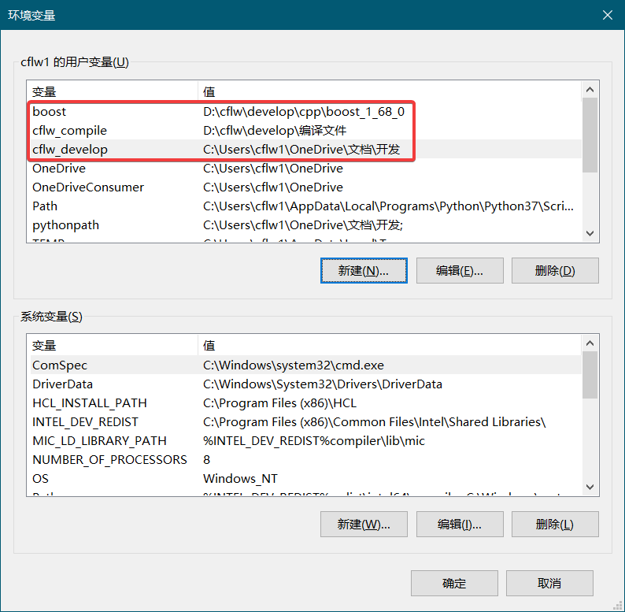

# 编译说明
由于我有一些文件放在网盘，一些文件放在网盘外。为了保证能正常编译使用，需要对开发环境做一些配置。

此说明适用于：[乘风龙王的代码库(c++)](https://github.com/cflw/cflw_cpp)、[用户界面](https://github.com/cflw/ui)、[东方山寨](https://github.com/cflw/dfsz)

## 第一步
从Github上下载的库的文件夹结构一般长这样：
* `cflw_cpp/cflw代码库`
* `ui/用户界面`
* `dfsz/东方山寨`

把库里面的文件夹拿出来放到`新建文件夹`中

## 第二步
添加环境变量`%cflw_develop%`，值设置为`新建文件夹`文件夹的位置。

添加环境变量`%cflw_compile%`，表示编译出来的文件放在哪，这个值随便设。

## 第三步
在属性管理器视图，对项目筛选器右键→添加现有属性表，添加`%cflw_develop%/cflw代码库/属性表.props`。添加完的属性表名称显示为`cflw属性表`，如果`cflw属性表`之前已存在则不用添加。

## 第四步
对`cflw属性表`右键→属性，在`用户宏`一页，值根据具体开发环境改成相应目录。

## 结束
可以开始使用了